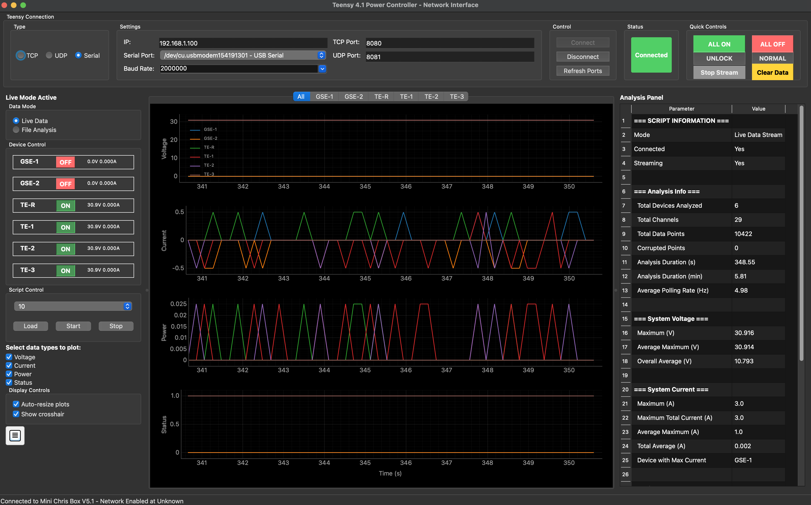
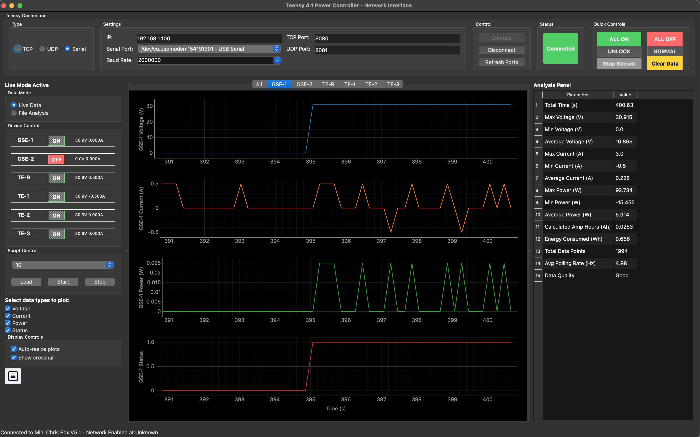
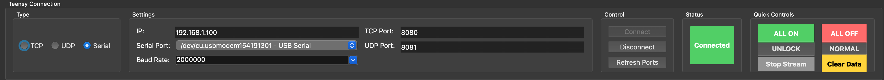

# Teensy 4.1 Power Controller - Network Interface

A comprehensive PyQt6-based application for real-time monitoring, control, and analysis of power data from Teensy 4.1 Power Controller systems. Originally designed for the NASA RockSatX 2025 mission, this application provides both live data streaming and historical data analysis capabilities with professional multi-panel interface supporting TCP/UDP/Serial communication protocols.

> ### Real-Time Live Data Streaming (All Devices View)
> 
> ### Individual Device Control & Analysis
> 
> ### Connection Management & Quick Controls
> 

## 🚀 Key Features

### Real-Time Operations
- **✅ Live Data Streaming**: Real-time monitoring at up to 20 FPS with smooth, non-flickering updates
- **✅ Device Control**: Individual and master control of GSE-1, GSE-2, TE-R, TE-1, TE-2, TE-3 outputs
- **✅ System Management**: Lock/unlock system, safety stop controls, fan speed adjustment
- **✅ Script Execution**: Load, start, pause, and stop automated scripts on the Teensy
- **✅ Multi-Protocol Support**: TCP, UDP, and USB Serial communication

### Data Analysis & Visualization
- **✅ Multi-Device Support**: Simultaneous monitoring of 6 power channels
- **✅ Smooth Plotting**: Eliminated flickering with 50ms update intervals and incremental data updates
- **✅ Window Modes**: Growing window and sliding time window (configurable duration)
- **✅ Interactive Crosshairs**: Precise value inspection with color-coded device identification
- **✅ Comprehensive Analytics**: Real-time voltage, current, power, and energy consumption analysis

### Professional Interface
- **✅ Dual-Mode Operation**: Switch between Live Data and File Analysis modes
- **✅ Tabbed Interface**: Device-specific views and combined "All" view with legends
- **✅ Settings System**: Comprehensive configuration for polling rates, display options, and data handling
- **✅ Debug Console**: Real-time command monitoring and JSON command interface
- **✅ Export Capabilities**: Text, CSV, and Excel export for both live and historical data

## 📋 Installation

### System Requirements
- **Python**: 3.8 or higher
- **Operating System**: Windows, macOS, or Linux
- **Memory**: 8GB RAM recommended for smooth real-time operation
- **Network**: Ethernet or WiFi for TCP/UDP communication (optional)

### Required Dependencies

```bash
# Core dependencies
pip install PyQt6 pyqtgraph numpy

# Serial communication (for USB connection)
pip install pyserial

# Optional dependencies for enhanced features
pip install pandas openpyxl  # Excel export support
pip install OpenGL-accelerate  # Hardware acceleration (optional)
```

### Quick Install (All Dependencies)

```bash
pip install PyQt6 pyqtgraph numpy pyserial pandas openpyxl
```

## 🖥️ Usage

### Starting the Application

```bash
python main.py [optional_file.json]
```

### Connection Setup

1. **Select Connection Type**:
   - **TCP**: Network connection (default port 8080)
   - **UDP**: Stateless network connection (default port 8081)  
   - **Serial**: USB connection (auto-detects available ports)

2. **Configure Settings**:
   - **IP Address**: Default 192.168.1.100 for network connections
   - **Baud Rate**: Default 2,000,000 for serial connections
   - **Polling Rate**: Configurable via Settings → Data tab

3. **Connect & Stream**:
   - Click **Connect** to establish communication
   - Click **Start Stream** to begin real-time data monitoring
   - Use **Quick Controls** for immediate device management

## 📊 Data Formats

### Live Data Format (JSON over TCP/UDP/Serial)

```json
{
  "type": "live_data",
  "timestamp": "14:30:25",
  "devices": [
    {
      "name": "gse1",
      "state": true,
      "voltage": 12.45,
      "current": 0.245,
      "power": 3.042
    },
    {
      "name": "gse2", 
      "state": false,
      "voltage": 0.0,
      "current": 0.0,
      "power": 0.0
    }
  ]
}
```

### Historical Data Format (JSON Files)

```json
{
  "timestamp": "2024-01-15T14:30:25",
  "duration_sec": 1800,
  "using_script": 1,
  "script_config": {
    "name": "mission_profile_1",
    "tstart": 0,
    "tend": 1800,
    "record": true
  },
  "data": [
    {
      "time": 1640995200000,
      "GSE-1_volt": 12.5,
      "GSE-1_curr": 2.1,
      "GSE-1_pow": 26.25,
      "GSE-1_stat": 1.0,
      "GSE-2_volt": 11.8,
      "GSE-2_curr": 1.9,
      "GSE-2_pow": 22.42,
      "GSE-2_stat": 0.0
    }
  ]
}
```

## 🎛️ Interface Overview

### Connection Panel (Top)
- **Connection Type**: TCP/UDP/Serial selection with settings
- **Status Indicator**: Visual connection status with controls
- **Quick Controls**: ALL ON/OFF, Lock/Unlock, Safety Stop, Stream control
- **Clear Data**: Reset live data buffer

### Main Interface (Three-Panel Layout)
1. **Left Panel - Control & Configuration**:
   - **Data Mode**: Live Data vs File Analysis toggle
   - **Device Controls**: Individual device ON/OFF with real-time status
   - **Script Controls**: Load, start, stop script execution
   - **Data Type Selection**: Voltage, Current, Power, Status checkboxes
   - **Display Options**: Auto-resize, crosshair toggles

2. **Center Panel - Tabbed Plot Area**:
   - **"All" Tab**: Combined view with color-coded legends
   - **Device Tabs**: GSE-1, GSE-2, TE-R, TE-1, TE-2, TE-3 individual views
   - **Smooth Plotting**: 50ms updates with no flickering
   - **Interactive Features**: Crosshair tracking, linked axes

3. **Right Panel - Real-Time Analysis**:
   - **Script Information**: Current script status and configuration
   - **Device Statistics**: Min/max/average values, energy consumption
   - **System Summary**: Multi-device aggregated analysis
   - **Data Quality**: Polling rates, corruption detection

## ⌨️ Keyboard Shortcuts

### File Operations
- `Ctrl+O` - Open historical data file
- `Ctrl+S` - Save analysis (format selection)
- `Ctrl+Shift+S` - Save live data
- `Ctrl+Q` - Exit application

### Connection & Control
- `F5` - Get Teensy status
- `Ctrl+Shift+X` - Open debug console

### Navigation
- `0` or `A` - Switch to "All" tab
- `1-6` - Switch to device tabs (GSE-1, GSE-2, TE-R, TE-1, TE-2, TE-3)
- `F9` - Toggle analysis side panel

### Settings
- `Ctrl+,` - Open settings dialog

## ⚙️ Advanced Features

### Settings Configuration (`Ctrl+,`)

**Data Tab**:
- **Polling Rate**: 50-5000ms intervals
- **Max Data Points**: Buffer size for live data
- **Window Modes**: Growing window vs Sliding time window
- **Data Filtering**: Moving average and interpolation options

**Display Tab**:
- **Auto-resize**: Automatic plot scaling
- **Line Thickness**: 1-10 pixel line width
- **Grid & Crosshair**: Visual enhancement options
- **Y-Axis Ranges**: Custom default ranges per data type

**Colors Tab**:
- **Device Colors**: Customizable color scheme for each device

**Connection Tab**:
- **Serial Baud Rate**: Configurable up to 2M baud

### Window Modes

**Growing Window Mode**:
- Continuously grows as data arrives
- Optional maximum point limit
- Best for short-term monitoring

**Sliding Time Window Mode**:
- Maintains fixed time duration view (1-300 seconds)
- Automatically scrolls with new data
- Perfect for continuous monitoring

### Debug Console (`Ctrl+Shift+X`)

- **Real-time Monitoring**: All communication traffic
- **JSON Commands**: Send custom commands to Teensy
- **Auto-scroll**: Continuous log viewing
- **Command History**: Previous commands accessible

### Script Management

- **Automatic Discovery**: Lists available scripts from Teensy
- **Load & Execute**: One-click script deployment
- **Status Monitoring**: Real-time script execution feedback
- **Integration**: Script information in analysis panel

## 📤 Export & Data Management

### Live Data Export
- **Automatic Timestamping**: All data timestamped for analysis
- **Multiple Formats**: JSON, CSV, Excel support
- **Real-time Saving**: Export during streaming
- **Metadata Inclusion**: Connection info, script details

### Analysis Export
- **Comprehensive Reports**: Device and system-wide analysis
- **Professional Formatting**: Multi-sheet Excel workbooks
- **Script Integration**: Automated vs manual recording identification
- **Energy Calculations**: Amp-hours and watt-hours analysis

## 🔧 Troubleshooting

### Connection Issues

**Cannot Connect to Teensy**:
- Verify IP address and port settings
- Check network connectivity (ping test)
- Ensure Teensy firmware is running
- Try different connection type (TCP → Serial)

**Serial Port Not Found**:
- Install pyserial: `pip install pyserial`
- Check USB cable connection
- Verify driver installation
- Click "Refresh Ports" button

### Performance Issues

**Flickering or Choppy Graphs**:
- ✅ **Fixed in v2.1**: Smooth 50ms updates implemented
- Reduce polling rate in Settings if needed
- Disable unnecessary data types
- Check "Auto-resize plots" setting

**High CPU Usage**:
- Reduce max data points in Settings
- Use Sliding Time Window mode
- Disable crosshair if not needed
- Close debug console when not in use

### Data Issues

**Missing Data or Gaps**:
- Check network stability for TCP/UDP
- Verify serial connection stability
- Monitor debug console for errors
- Adjust polling rate based on system capability

**Incorrect Values**:
- Verify Teensy firmware compatibility
- Check device calibration
- Review data conversion settings
- Use debug console to monitor raw data

## 🆕 Recent Updates (v2.1)

### Performance Enhancements
- ✅ **Eliminated Graph Flickering**: Stable 50ms update intervals
- ✅ **Smooth Data Flow**: No more chunky updates
- ✅ **Fixed Plot Initialization**: Immediate graph display when streaming starts
- ✅ **Optimized Memory Usage**: Efficient deque-based data management

### Feature Additions
- ✅ **Sliding Time Window**: Configurable duration with real-time scrolling
- ✅ **Enhanced Legend Support**: Color-coded device identification
- ✅ **Improved Status Plots**: Stable Y-axis scaling for digital signals
- ✅ **Debug Console**: Comprehensive monitoring and command interface

### Bug Fixes
- ✅ **Plot Layout Stability**: Fixed height jumping issues
- ✅ **Data Type Conversion**: Proper current unit handling (mA → A)
- ✅ **Tab Switching**: Immediate plot updates when changing views
- ✅ **Window Mode**: Fixed sliding window time calculations

## 📈 System Specifications

### Supported Devices
- **GSE-1**: Ground Support Equipment #1
- **GSE-2**: Ground Support Equipment #2  
- **TE-R**: Test Equipment - Recorder
- **TE-1**: Test Equipment #1
- **TE-2**: Test Equipment #2
- **TE-3**: Test Equipment #3

### Measurement Ranges
- **Voltage**: 0-35V (configurable)
- **Current**: 0-5A (configurable)
- **Power**: 0-100W (calculated)
- **Status**: Digital ON/OFF states

### Communication Specifications
- **TCP**: Port 8080 (default), persistent connection
- **UDP**: Port 8081 (default), stateless packets
- **Serial**: Up to 2M baud, USB connection
- **Update Rate**: 50ms minimum, configurable up to 5000ms

## 🎯 Mission Applications

Originally developed for the **NASA RockSatX 2025 mission**, this application provides:

- **Pre-Flight Testing**: Comprehensive system validation
- **Real-Time Monitoring**: Live mission data streaming
- **Post-Flight Analysis**: Detailed performance evaluation
- **Energy Management**: Power consumption optimization
- **Fault Detection**: Real-time anomaly identification

## 📞 Support & Development

### Feature Requests
- Real-time data streaming ✅ **Completed**
- Advanced filtering options ⏳ **In Progress**
- Automated timed events ✅ **Completed**
- Telemetry input support 📋 **Planned**

### Known Limitations
- Maximum 6 simultaneous devices
- JSON-based communication protocol
- Windows/macOS/Linux desktop only

### Development Status
- **Version**: 2.1
- **Status**: Active Development
- **License**: MIT
- **Platform**: Cross-platform (Python 3.8+)

---

**Developed for NASA RockSatX 2025 Mission**  
**Author**: Aram Aprahamian  
**Last Updated**: July 2025

For technical support or feature requests, ensure your setup meets the minimum requirements and check the debug console for detailed error information.

