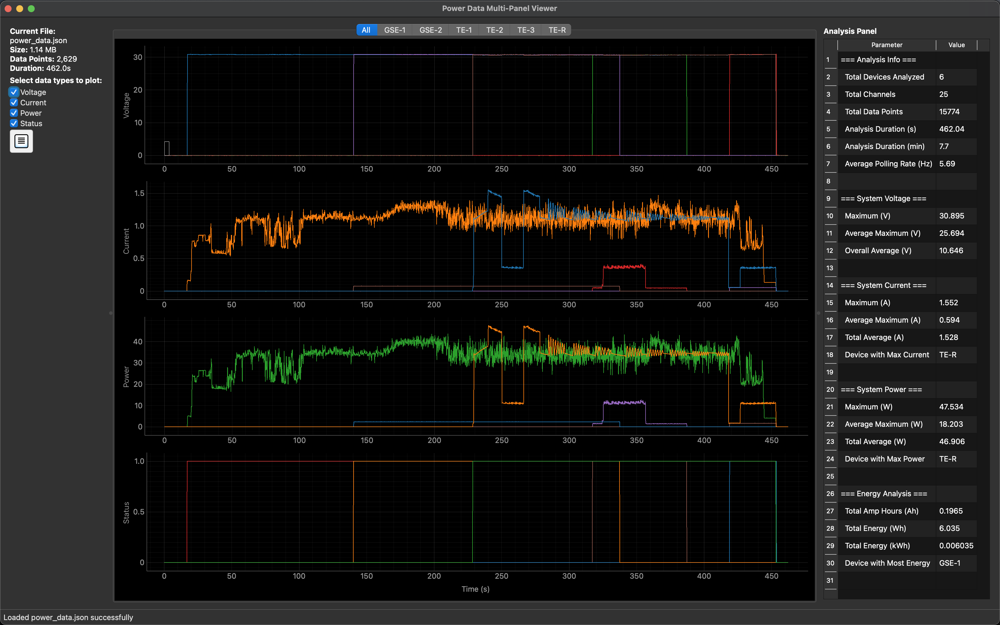
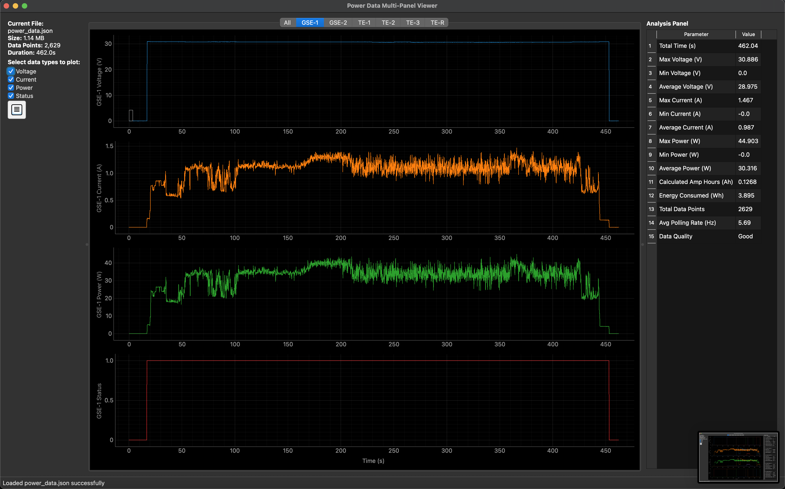

# Power Data Multi-Panel Viewer

A PyQt6-based application for analyzing and visualizing power data collected from multiple devices (designed around the Mini Chris Box, built for the NASA RockSatX 2025 mission). It features a professional, multi-panel interface that allows users to view and analyze voltage, current, power, and energy consumption data and possesses the ability to export analysis results in various formats.

> ### Full Device Power View
> 
> ### GSE-1 Device Power View (TE-1, TE-2, TE-3, TE-R not shown)
> 

## Features

- **Multi-Output Support**: Analyze data from GSE-1, GSE-2, TE-1, TE-2, TE-3, and TE-R devices
- **Tabbed Interface**: Switch between device-specific views and combined "All" view
- **Comprehensive Analytics**: Voltage, current, power, and energy consumption analysis
- **Export Capabilities**: Save analysis results to Text, CSV, or Excel formats
- **Recent Files**: Quick access to recently opened data files
- **Professional UI**: Clean, intuitive interface with customizable panels

## Installation

### Requirements

- Python 3.7 or higher
- PyQt6
- pyqtgraph
- numpy

### Optional Dependencies (for Excel export)
- pandas
- openpyxl

### Install Dependencies

```bash
# Required dependencies
pip install PyQt6 pyqtgraph numpy

# Optional dependencies for Excel export
pip install pandas openpyxl
```

## Usage

### Starting the Application

```bash
python power_analyzer.py [optional_file.json]
```

You can optionally specify a JSON file to load on startup.

### Supported Data Format

The application expects JSON files with the following structure:

```json
{
  "data": [
    {
      "time": 1640995200000,
      "GSE-1_volt": 12.5,
      "GSE-1_curr": 2100,
      "GSE-1_pow": 26.25,
      "GSE-1_stat": 1,
      "GSE-2_volt": 11.8,
      "GSE-2_curr": 1900,
      "GSE-2_pow": 22.42,
      "GSE-2_stat": 1,
      "TE-1_volt": 13.2,
      "TE-1_curr": 2300,
      "TE-1_pow": 30.36,
      "TE-1_stat": 1,
      "TE-2_volt": 12.1,
      "TE-2_curr": 2000,
      "TE-2_pow": 24.2,
      "TE-2_stat": 1,
      "TE-3_volt": 11.9,
      "TE-3_curr": 1850,
      "TE-3_pow": 22.02,
      "TE-3_stat": 1,
      "TE-R_volt": 12.8,
      "TE-R_curr": 2150,
      "TE-R_pow": 27.52,
      "TE-R_stat": 1
    }
  ]
}
```

**Important Notes:**
- Time values should be in milliseconds (Unix timestamp)
- Current values should be in milliamps (automatically converted to amps)
- Device names follow the pattern: `GSE-1`, `GSE-2`, `TE-1`, `TE-2`, `TE-3`, `TE-R`
- Data types: `volt` (voltage), `curr` (current), `pow` (power), `stat` (status)

## Interface Overview

### Main Interface

1. **Left Panel**: File information and data type selection (Voltage, Current, Power, Status)
2. **Center Panel**: Tabbed plot area with device-specific and combined views
3. **Right Panel**: Analysis data (toggleable, default open)

### Tabs

- **All Tab**: Combined view showing all devices on separate graphs for each data type
- **Device Tabs**: Individual tabs for GSE-1, GSE-2, TE-1, TE-2, TE-3, TE-R showing device-specific data

### Data Type Selection

Use the checkboxes in the left panel to show/hide:
- ✅ **Voltage**: Device voltage readings (V)
- ✅ **Current**: Device current consumption (A)
- ✅ **Power**: Device power consumption (W)
- ✅ **Status**: Device operational status

## Keyboard Shortcuts

### File Operations
- `Ctrl+O` - Open file
- `Ctrl+S` - Save analysis (shows format selection dialog)
- `Ctrl+Q` - Exit application

### Navigation
- `0` or `A` - Switch to "All" tab
- `1` - Switch to GSE-1 tab
- `2` - Switch to GSE-2 tab
- `3` - Switch to TE-1 tab
- `4` - Switch to TE-2 tab
- `5` - Switch to TE-3 tab
- `6` - Switch to TE-R tab

### View Controls
- `X` - Toggle side panel

## Features

### Interactive Graphs

- **Crosshair Cursor**: Move your mouse over any graph to see precise values
- **Linked X-Axes**: All graphs scroll and zoom together
- **Color-Coded Data**: Each device has a unique color for easy identification
- **Professional Labels**: Clean axis labels with proper units (V, A, W)

### Analysis Panel

The right side panel shows comprehensive analysis including:

**Device-Specific Analysis** (when viewing individual device tabs):
- Voltage statistics (min, max, average)
- Current statistics with amp-hour calculations
- Power analysis and energy consumption
- Data quality indicators
- Polling rate information

**System Summary** (when viewing "All" tab):
- System-wide voltage analysis
- Total current and power consumption
- Energy analysis across all devices
- Device performance comparisons

### Export Options

Save your analysis in multiple formats:

1. **Text (.txt)**: Human-readable analysis report
2. **CSV (.csv)**: Spreadsheet-compatible data
3. **Excel (.xlsx)**: Professional multi-sheet workbook with device-specific sheets

Access export options via:
- `Ctrl+S` → Format selection dialog
- `File` → `Export Analysis` → Choose format

## File Management

### Recent Files
- Automatically tracks recently opened files
- Access via `File` → `Recent Files`
- Clears non-existent files automatically

### File Validation
The application validates JSON files for:
- Proper JSON structure
- Required time field
- Expected device data fields
- Data consistency

## Tips for Best Results

1. **Data Quality**: Ensure your JSON files have consistent timestamps and no missing data points
2. **File Size**: The application handles large files efficiently, but very large datasets may require more memory
3. **Export Timing**: Export analysis after viewing the data to ensure all calculations are complete
4. **Keyboard Navigation**: Use keyboard shortcuts for faster navigation between devices
5. **Side Panel**: Keep the analysis panel open to monitor real-time statistics while browsing data

    ## TODO:
    - [ ] Add support for real-time data streaming
    - [ ] Implement advanced filtering options
    - [X] Add automated timed events
    - [ ] Add telemetry input support

## Troubleshooting

### Common Issues

**File Won't Load**
- Check JSON syntax validity
- Ensure required device fields are present
- Verify time field exists and contains valid timestamps

**Missing Excel Export**
- Install optional dependencies: `pip install pandas openpyxl`

**Graphs Not Displaying**
- Check that at least one data type is selected in the left panel
- Verify the selected device has data in the JSON file

**Performance Issues**
- For very large files, consider reducing the number of visible data types
- Close unused applications to free up memory

### Error Messages

- **"Invalid JSON structure"**: Your file doesn't match the expected format
- **"Missing required fields"**: Device data fields are missing from the JSON
- **"No analysis data available"**: No valid device data found in the file

## Support

For issues or feature requests, please check that:
1. Your JSON file follows the correct format
2. All required dependencies are installed
3. You're using a supported Python version (3.7+)

## System Requirements

- **Operating System**: Windows, macOS, or Linux
- **Python**: 3.7 or higher
- **Memory**: Minimum 4GB RAM (8GB recommended for large datasets)
- **Storage**: Minimal space required for application, additional space for data files

---

**Version**: 2.0  
**License**: MIT  
**Author**: Aram Aprahamian

